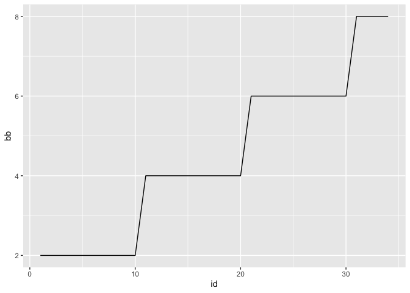
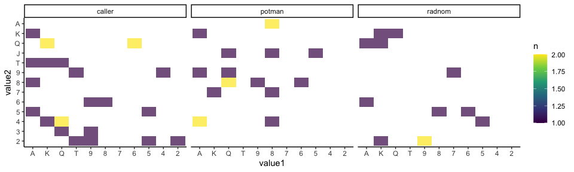

# Pokerena ♣️ ♦️ ♥️ ♠️

A Poker engine for AI development in R.

## Tutorial

This tutorial leads you to start point of poker AI development…

… But first install.

``` r
devtools::install_github("systats/pokerena")
```

There are two main ways to deploy a bot, as there are two ways for using
the poker backend.

1.  preregister functions in interactive R session
2.  call a separate HTTP API endpoint from a job.

In general players just return a tibble with an action and amount of
chips to bet.

``` r
player_call <- function(state_, ...){
  tibble(chips = state_$to_call, action = "call")
}
```

``` r
players <- rbind(
  tibble(name = "call", fun = list(player_call)), # player 1
  tibble(name = "radnom1", fun = list(player_random)), # player 2
  tibble(name = "fold", fun = list(player_fold)) # player 4
) %>% mutate(credit = 100, bb = 2)
```

``` r
g <- game$new(players, delay = 0)
g$run()
```

``` r
g$session %>% glimpse
```

    ## Rows: 3
    ## Columns: 24
    ## $ game_id  <chr> "1596876514991675904", "1596876514991675904", "1596876514991…
    ## $ time     <chr> "2020-08-08 10:48:34", "2020-08-08 10:48:34", "2020-08-08 10…
    ## $ name     <chr> "call", "radnom1", "fold"
    ## $ credit   <dbl> 98, 98, 100
    ## $ bb       <dbl> 2, 2, 2
    ## $ seat_id  <int> 1, 2, 3
    ## $ position <int> 1, 2, 3
    ## $ state    <dbl> 1, 1, 1
    ## $ chips    <dbl> 1, 0, 0
    ## $ to_call  <dbl> 0, 0, 2
    ## $ s_stake  <dbl> 2, 2, 0
    ## $ t_stake  <dbl> 2, 2, 0
    ## $ pot      <dbl> 4, 4, 4
    ## $ allin    <dbl> 0, 0, 0
    ## $ folded   <dbl> 0, 1, 1
    ## $ n_player <int> 3, 3, 3
    ## $ n_in     <dbl> 1, 1, 1
    ## $ hand     <chr> "5C 6H", "AC 9D", "7C QC"
    ## $ board    <chr> "", "", ""
    ## $ runout   <chr> "", "", ""
    ## $ winner   <dbl> 1, 0, 0
    ## $ rank     <dbl> 1, 2, 2
    ## $ ret      <dbl> 4, 0, 0
    ## $ net      <dbl> 2, -2, 0

``` r
g$events %>% glimpse
```

    ## Rows: 5
    ## Columns: 30
    ## $ game_id  <chr> "1596876514991675904", "1596876514991675904", "1596876514991…
    ## $ time     <chr> "2020-08-08 10:48:34", "2020-08-08 10:48:34", "2020-08-08 10…
    ## $ name     <chr> "call", "radnom1", "fold", "call", "radnom1"
    ## $ credit   <dbl> 100, 100, 100, 99, 98
    ## $ bb       <dbl> 2, 2, 2, 2, 2
    ## $ seat_id  <int> 1, 2, 3, 1, 2
    ## $ position <int> 1, 2, 3, 1, 2
    ## $ state    <dbl> 1, 1, 1, 1, 1
    ## $ chips    <dbl> 1, 2, 0, 1, 0
    ## $ to_call  <dbl> 2, 2, 2, 1, 0
    ## $ s_stake  <dbl> 0, 0, 0, 1, 2
    ## $ t_stake  <dbl> 0, 0, 0, 1, 2
    ## $ pot      <dbl> 0, 0, 3, 3, 4
    ## $ allin    <dbl> 0, 0, 0, 0, 0
    ## $ folded   <dbl> 0, 0, 1, 0, 1
    ## $ n_player <int> 3, 3, 3, 3, 3
    ## $ n_in     <dbl> 3, 3, 3, 2, 2
    ## $ hand     <chr> "", "", "7C QC", "5C 6H", "AC 9D"
    ## $ board    <chr> "", "", "", "", ""
    ## $ action   <chr> "sb", "bb", "fold", "call", "fold"
    ## $ stake    <dbl> 1, 2, 0, 1, 0
    ## $ t_stake_ <dbl> 1, 2, 0, 2, 2
    ## $ s_stake_ <dbl> 1, 2, 0, 2, 2
    ## $ credit_  <dbl> 99, 98, 100, 98, 98
    ## $ pot_     <dbl> 1, 2, 3, 4, 4
    ## $ runout   <chr> "", "", "", "", ""
    ## $ winner   <dbl> 1, 0, 0, 1, 0
    ## $ rank     <dbl> 1, 2, 2, 1, 2
    ## $ ret      <dbl> 4, 0, 0, 4, 0
    ## $ net      <dbl> 2, -2, 0, 2, -2

Similarily a tournament can be set up.

``` r
config <- list(
  credit = 100, # inital stack size, if NULL assumes individual credits
  max_round = 50, # how many rounds at max should be played
  bb = 2, # inital big blind
  bb_rounds = 10, # increase blinds after x hands
  bb_slope = "linear" # how to increase blinds
)

tourn <- tournament$new(players, config)
tourn$run()
```

``` r
tourn$games %>% glimpse
```

    ## Rows: 34
    ## Columns: 4
    ## $ game_id <chr> "1596876515267985920", "1596876515515056896", "15968765156106…
    ## $ result  <list> [<tbl_df[3 x 7]>, <tbl_df[3 x 7]>, <tbl_df[3 x 7]>, <tbl_df[…
    ## $ events  <list> [<tbl_df[10 x 30]>, <tbl_df[5 x 30]>, <tbl_df[7 x 30]>, <tbl…
    ## $ log     <list> [<tbl_df[0 x 0]>, <tbl_df[0 x 0]>, <tbl_df[0 x 0]>, <tbl_df[…

``` r
tourn$games %>% 
  transmute(id = 1:n(), result) %>% 
  unnest("result") %>% 
  distinct(id, bb) %>% 
  ggplot(aes(id, bb)) +
  geom_line()
```

<!-- -->

``` r
tourn$games %>% 
  transmute(id = 1:n(), result) %>% 
  unnest("result") %>% 
  ggplot(aes(id, credit, colour = name)) + 
  geom_line()
```

<!-- -->

``` r
tourn$games %>% 
  transmute(id = 1:n(), result) %>% 
  unnest("result") %>% 
  group_by(id) %>% 
  mutate(winner_name  = ifelse(winner == 1, name, NA)) %>% 
  fill(winner_name, .direction = "updown") %>% 
  ungroup() %>% 
  group_by(name, winner_name) %>% 
  summarise(net = sum(net))
```

    ## # A tibble: 6 x 3
    ## # Groups:   name [3]
    ##   name    winner_name   net
    ##   <chr>   <chr>       <dbl>
    ## 1 call    call          219
    ## 2 call    fold          -19
    ## 3 fold    call          -95
    ## 4 fold    fold           -5
    ## 5 radnom1 call         -124
    ## 6 radnom1 fold           24

## Main Dependencies

  - `Poker`: generic R poker hand evaluator
  - `Plumber`: serving a local poker server
  - `R6`: class management
  - `Tidyvrse`: everything else

## Unit Testing

``` r
testthat::test_package("pokerena")
```

    ## ══ testthat results  ══════════════════════════════════════════
    ## [ OK: 18 | SKIPPED: 0 | WARNINGS: 0 | FAILED: 0 ]

## Roadmap

### Engine

  - \[x\] support going allin
  - \[x\] poker hand evaluation
  - \[x\] multiple split and side pots
  - \[x\] tournament flow
  - \[ \] log messages for debugging
  - \[ \] unit tests for more situations
  - \[ \] improved cli output

### AI

  - \[ \] RL script with replay buffer
  - \[ \] support for multiplayer self-play
  - \[ \] support replay for MCCFR
  - \[ \] tree search and pruning

### Analytics

  - \[ \] Leaderboard
  - \[ \] HUD
