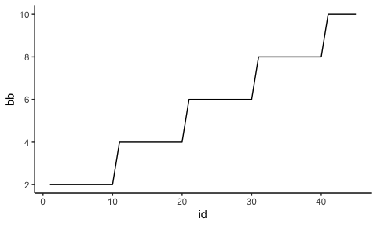
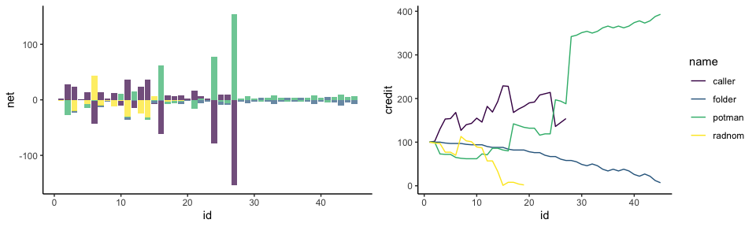
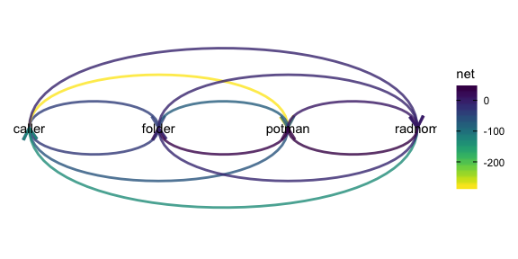

# Pokerena ♣️ ♦️ ♠️ ♥️

A Poker engine for AI development in R.

## Tutorial

This tutorial leads you to start point of poker AI development…

… But first install.

``` r
devtools::install_github("systats/pokerena")
```

There are two main ways to deploy a bot, as there are two ways for using
the poker backend.

1.  preregister functions in interactive R session
2.  call a separate HTTP API endpoint from a job.

In general players just return a tibble with an action and amount of
chips to bet.

``` r
player_call <- function(state_, ...){
  tibble(chips = state_$to_call, action = "call")
}
```

``` r
players <- rbind(
  tibble(name = "caller", fun = list(player_call)), # player 1
  tibble(name = "radnom", fun = list(player_random)), # player 2
  tibble(name = "potman", fun = list(player_api)), # player 2
  tibble(name = "folder", fun = list(player_fold)) # player 4
) %>% mutate(credit = 100, bb = 2)
```

``` r
g <- game$new(players, delay = 0)
g$run()
```

``` r
g$session %>% glimpse
```

    ## Rows: 4
    ## Columns: 25
    ## $ game_id  <chr> "1596881183657158912", "1596881183657158912", "1596881183657…
    ## $ time     <chr> "2020-08-08 12:06:23", "2020-08-08 12:06:23", "2020-08-08 12…
    ## $ name     <chr> "caller", "radnom", "potman", "folder"
    ## $ credit   <dbl> 65, 98, 65, 100
    ## $ bb       <dbl> 2, 2, 2, 2
    ## $ seat_id  <int> 1, 2, 3, 4
    ## $ position <int> 1, 2, 3, 4
    ## $ state    <dbl> 4, 4, 4, 4
    ## $ chips    <dbl> 15, 0, 15, 0
    ## $ to_call  <dbl> 0, 33, 0, 35
    ## $ s_stake  <dbl> 15, 0, 15, 0
    ## $ t_stake  <dbl> 35, 2, 35, 0
    ## $ pot      <dbl> 72, 72, 72, 72
    ## $ allin    <dbl> 0, 0, 0, 0
    ## $ folded   <dbl> 0, 1, 0, 1
    ## $ n_player <int> 4, 4, 4, 4
    ## $ n_in     <dbl> 2, 2, 2, 2
    ## $ hand     <chr> "10D 9C", "AD 8H", "KS KD", "2C 9D"
    ## $ board    <chr> "10C 4S 3C 5H 6S", "10C 4S 3C 5H 6S", "10C 4S 3C 5H 6S", "10…
    ## $ runout   <chr> "10C 4S 3C 5H 6S", "10C 4S 3C 5H 6S", "10C 4S 3C 5H 6S", "10…
    ## $ main     <chr> "One Pair", "High Card", "One Pair", "Straight"
    ## $ winner   <dbl> 0, 0, 0, 1
    ## $ rank     <int> 3, 4, 2, 1
    ## $ ret      <dbl> 0, 0, 72, 0
    ## $ net      <dbl> -35, -2, 37, 0

``` r
g$events %>% glimpse
```

    ## Rows: 15
    ## Columns: 30
    ## $ game_id  <chr> "1596881183657158912", "1596881183657158912", "1596881183657…
    ## $ time     <chr> "2020-08-08 12:06:23", "2020-08-08 12:06:23", "2020-08-08 12…
    ## $ name     <chr> "caller", "radnom", "potman", "folder", "caller", "radnom", …
    ## $ credit   <dbl> 100, 100, 100, 100, 99, 98, 96, 96, 96, 91, 91, 91, 80, 80, …
    ## $ bb       <dbl> 2, 2, 2, 2, 2, 2, 2, 2, 2, 2, 2, 2, 2, 2, 2
    ## $ seat_id  <int> 1, 2, 3, 4, 1, 2, 1, 3, 1, 1, 3, 1, 1, 3, 1
    ## $ position <int> 1, 2, 3, 4, 1, 2, 1, 3, 1, 1, 3, 1, 1, 3, 1
    ## $ state    <dbl> 1, 1, 1, 1, 1, 1, 2, 2, 2, 3, 3, 3, 4, 4, 4
    ## $ chips    <dbl> 1, 2, 4, 0, 3, 0, 0, 5, 5, 0, 11, 11, 0, 15, 15
    ## $ to_call  <dbl> 2, 2, 2, 4, 3, 2, 0, 0, 5, 0, 0, 11, 0, 0, 15
    ## $ s_stake  <dbl> 0, 0, 0, 0, 1, 2, 0, 0, 0, 0, 0, 0, 0, 0, 0
    ## $ t_stake  <dbl> 0, 0, 0, 0, 1, 2, 4, 4, 4, 9, 9, 9, 20, 20, 20
    ## $ pot      <dbl> 0, 0, 3, 7, 7, 10, 10, 10, 15, 20, 20, 31, 42, 42, 57
    ## $ allin    <dbl> 0, 0, 0, 0, 0, 0, 0, 0, 0, 0, 0, 0, 0, 0, 0
    ## $ folded   <dbl> 0, 0, 0, 1, 0, 1, 0, 0, 0, 0, 0, 0, 0, 0, 0
    ## $ n_player <int> 4, 4, 4, 4, 4, 4, 4, 4, 4, 4, 4, 4, 4, 4, 4
    ## $ n_in     <dbl> 4, 4, 4, 4, 3, 3, 2, 2, 2, 2, 2, 2, 2, 2, 2
    ## $ hand     <chr> "", "", "KS KD", "2C 9D", "10D 9C", "AD 8H", "10D 9C", "KS K…
    ## $ board    <chr> "", "", "", "", "", "", "10C 4S 3C", "10C 4S 3C", "10C 4S 3C…
    ## $ action   <chr> "sb", "bb", "raise", "fold", "call", "fold", "check", "raise…
    ## $ stake    <dbl> 1, 2, 4, 0, 3, 0, 0, 5, 5, 0, 11, 11, 0, 15, 15
    ## $ t_stake_ <dbl> 1, 2, 4, 0, 4, 2, 4, 9, 9, 9, 20, 20, 20, 35, 35
    ## $ s_stake_ <dbl> 1, 2, 4, 0, 4, 2, 0, 5, 5, 0, 11, 11, 0, 15, 15
    ## $ credit_  <dbl> 99, 98, 96, 100, 96, 98, 96, 91, 91, 91, 80, 80, 80, 65, 65
    ## $ pot_     <dbl> 1, 2, 7, 7, 10, 10, 10, 15, 20, 20, 31, 42, 42, 57, 72
    ## $ runout   <chr> "10C 4S 3C 5H 6S", "10C 4S 3C 5H 6S", "10C 4S 3C 5H 6S", "10…
    ## $ winner   <dbl> 0, 0, 0, 1, 0, 0, 0, 0, 0, 0, 0, 0, 0, 0, 0
    ## $ rank     <int> 3, 4, 2, 1, 3, 4, 3, 2, 3, 3, 2, 3, 3, 2, 3
    ## $ ret      <dbl> 0, 0, 72, 0, 0, 0, 0, 72, 0, 0, 72, 0, 0, 72, 0
    ## $ net      <dbl> -35, -2, 37, 0, -35, -2, -35, 37, -35, -35, 37, -35, -35, 37…

Similarily a tournament can be set up.

``` r
config <- list(
  credit = 100, # inital stack size, if NULL assumes individual credits
  max_round = 50, # how many rounds at max should be played
  bb = 2, # inital big blind
  bb_rounds = 10, # increase blinds after x hands
  bb_slope = "linear" # how to increase blinds
)

tourn <- tournament$new(players, config)
tourn$run(T)
```

``` r
tourn$games %>% glimpse
```

    ## Rows: 45
    ## Columns: 4
    ## $ game_id <chr> "1596879102417853952", "1596879103175256064", "15968791053602…
    ## $ result  <list> [<tbl_df[4 x 7]>, <tbl_df[4 x 7]>, <tbl_df[4 x 7]>, <tbl_df[…
    ## $ events  <list> [<tbl_df[6 x 30]>, <tbl_df[13 x 30]>, <tbl_df[12 x 30]>, <tb…
    ## $ log     <list> [<tbl_df[0 x 0]>, <tbl_df[0 x 0]>, <tbl_df[0 x 0]>, <tbl_df[…

``` r
tourn$games %>% 
  transmute(id = 1:n(), result) %>% 
  unnest("result") %>% 
  distinct(id, bb) %>% 
  ggplot(aes(id, bb)) +
  geom_line()
```



``` r
credit <- tourn$games %>% 
  transmute(id = 1:n(), result) %>% 
  unnest("result") %>% 
  ggplot(aes(id, credit, colour = name)) + 
  geom_line() +
  scale_colour_viridis_d()

net <- tourn$games %>% 
  transmute(id = 1:n(), result) %>% 
  unnest("result") %>% 
  ggplot(aes(id, net, fill = name)) + 
  geom_col(postion = ggplot2::position_dodge(), alpha = .7, show.legend = F) +
  scale_fill_viridis_d()

gridExtra::grid.arrange(net, credit, ncol = 2)
```



``` r
ranges <- tourn$games %>% 
  transmute(id = 1:n(), events) %>% 
  unnest("events") %>% 
  filter(hand != "" & action != "fold") %>% 
  distinct(game_id, name, hand) %>%
  mutate(hand = hand %>% stringr::str_replace_all("10", "T")) %>% 
  tidyr::separate(hand, into = c("card1", "card2"), sep = "\\s+") %>% 
  left_join(pockets_both()) %>% 
  count(name, value1, value2)

ranges %>% 
  ggplot(aes(value1, value2, fill = n)) +
  geom_tile(alpha = .7) +
  scale_fill_viridis_c() +
  facet_wrap(~name) #, scales = "free_y" 
```


``` r
library(tidygraph)
library(ggraph)

pay_network <- tourn$games %>% 
  transmute(id = 1:n(), result) %>% 
  unnest("result") %>% 
  group_by(id) %>% 
  mutate(winner_name  = ifelse(winner == 1, name, NA)) %>% 
  fill(winner_name, .direction = "updown") %>% 
  ungroup() %>% 
  group_by(name, winner_name) %>% 
  summarise(net = sum(net)) %>% 
  as_tbl_graph()

pay_network %>% 
  ggraph(layout = 'linear') + #, circular = TRUE
  geom_edge_arc0(aes(colour = net), arrow = arrow(length = unit(4, 'mm')), width = 1, alpha = .8) +
  #scale_edge_alpha('Pay direction', guide = 'edge_direction') + 
  scale_edge_color_viridis(direction = -1) +
  geom_node_text(aes(label = name))
```



## Main Dependencies

  - `Poker`: generic R poker hand evaluator
  - `Plumber`: serving a local poker server
  - `R6`: class management
  - `Tidyvrse`: everything else

## Unit Testing

``` r
testthat::test_package("pokerena")
```

    ## ══ testthat results  ══════════════════════════════════════════
    ## [ OK: 18 | SKIPPED: 0 | WARNINGS: 0 | FAILED: 0 ]

## Roadmap

### Engine

  - \[x\] support going allin
  - \[x\] poker hand evaluation
  - \[x\] multiple split and side pots
  - \[x\] tournament flow
  - \[ \] log messages for debugging
  - \[ \] unit tests for more situations
  - \[ \] improved cli output

### AI

  - \[ \] RL script with replay buffer
  - \[ \] support for multiplayer self-play
  - \[ \] support replay for MCCFR
  - \[ \] tree search and pruning

### Analytics

  - \[ \] Leaderboard
  - \[ \] HUD
